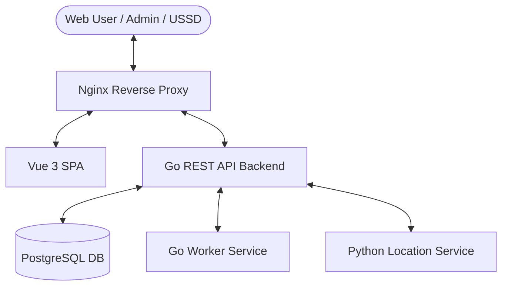

# NCS Portal Codebase Structure

This document provides a comprehensive structure of the National Council of Sports (NCS) Portal codebase located at `C:/NCSPortal`. It outlines the roles and relationships of each directory, subdirectory, and key file within the architecture.

---

## 🏗️ System Architecture Overview

The system is a containerized multi-tier web application composed of five primary services orchestrated by Docker Compose:

1. **Nginx Reverse Proxy**: Directs incoming HTTP/HTTPS traffic to the correct backend or frontend service.
2. **Vue 3 Frontend**: Single Page Application (SPA) built using Vite, Tailwind CSS, Pinia, and Vue Router.
3. **Go REST API Backend**: The primary database driver, controller hub, and operational agent layer.
4. **Go Worker**: Run-loop agent processing background queues (such as backups, cleanups, email schedules).
5. **Location Service (Python)**: A FastAPI microservice carrying out IP location analysis, VPN filtering, and geo-restrictions (ensuring compliance and preventing foreign spoofing).
6. **PostgreSQL Database**: Data storage utilizing 61 structural migration revisions.

---

## 📂 Codebase Directory Tree

### 📁 Root Directory
Contains configuration files for orchestration, deployment recipes, environment templates, and server configurations.

*   `[docker-compose.yml](file:///C:/NCSPortal/docker-compose.yml)`: Defines services, volumes, networks, port maps, and health checks.
*   `[docker-compose.override.yml](file:///C:/NCSPortal/docker-compose.override.yml)`: Local environment and build variations.
*   `[.env](file:///C:/NCSPortal/.env)` / `[.env.example](file:///C:/NCSPortal/.env.example)`: Environment variables defining ports, credentials, URL origins, and parameters.
*   `[NCS_PORTAL_DEPLOYMENT.md](file:///C:/NCSPortal/NCS_PORTAL_DEPLOYMENT.md)`: Production deployment instructions, SSH commands, backup routines, and VPS layouts.
*   `[CHANGELOG.md](file:///C:/NCSPortal/CHANGELOG.md)`: Historical update timeline detailing features, bug fixes, and maintenance cycles.
*   `[Credentials.md](file:///C:/NCSPortal/Credentials.md)`: Server IP and access configurations.
*   `[Sketch.md](file:///C:/NCSPortal/Sketch.md)` / `[Sketch2.md](file:///C:/NCSPortal/Sketch2.md)`: Interface drafts and organizational definitions (Mission, Vision, and Mandate text blocks).

---

### 📁 Backend (`/backend`)
The backend is a Go (1.25+) REST API application based on `go-chi`.

*   `[go.mod](file:///C:/NCSPortal/backend/go.mod)`: Module descriptor and dependency matrix.
*   `[Dockerfile](file:///C:/NCSPortal/backend/Dockerfile)`: Multistage build setup compiling the Go binaries.

#### 📁 Entrypoints (`/backend/cmd`)
*   `[server/main.go](file:///C:/NCSPortal/backend/cmd/server/main.go)`: Configures routing, CORS rules, security headers, rate limiting policies, database pools, and starts the HTTP server.
*   `[worker/main.go](file:///C:/NCSPortal/backend/cmd/worker/main.go)`: Background job worker loop.
*   `[ops-agent/main.go](file:///C:/NCSPortal/backend/cmd/ops-agent/main.go)`: Command-line agent for operators (seeds, checks, and administration).

#### 📁 Backend Core Logic (`/backend/internal`)
*   `[config/config.go](file:///C:/NCSPortal/backend/internal/config/config.go)`: Parses env parameters into structured system configurations.
*   `[database/db.go](file:///C:/NCSPortal/backend/internal/database/db.go)`: Initiates pgx connection pools with safety checks.
*   `[logging/logging.go](file:///C:/NCSPortal/backend/internal/logging/logging.go)`: Implements unified structured logging using Go's `slog`.
*   `[maintenance/](file:///C:/NCSPortal/backend/internal/maintenance)`:
    *   `[state.go](file:///C:/NCSPortal/backend/internal/maintenance/state.go)`: Thread-safe global maintenance state (CMS vs Admin panel lockout scopes).
    *   `[sentinel.go](file:///C:/NCSPortal/backend/internal/maintenance/sentinel.go)`: Automatically resolves or schedules maintenance shutdowns.
*   `[metrics/metrics.go](file:///C:/NCSPortal/backend/internal/metrics/metrics.go)`: Telemetry registries capturing request count, latency, and system load.
*   `[response/response.go](file:///C:/NCSPortal/backend/internal/response/response.go)`: Standard JSON encoders and error responders.
*   `[models/models.go](file:///C:/NCSPortal/backend/internal/models/models.go)`: Domain entities and parameters (User, Role, Application, Form, Page, Slide, Document).
*   `[storage/](file:///C:/NCSPortal/backend/internal/storage)`:
    *   `[uploader.go](file:///C:/NCSPortal/backend/internal/storage/uploader.go)`: File uploads sanitization and persistence.
    *   `[settings.go](file:///C:/NCSPortal/backend/internal/storage/settings.go)`: Handles file storage settings (local disk vs potential cloud storage adapters).

#### 📁 Request Middlewares (`/backend/internal/middleware`)
*   `[middleware.go](file:///C:/NCSPortal/backend/internal/middleware/middleware.go)`: Houses primary middlewares including authentication enforcement, JWT verification, security headers (HSTS, CSP, XSS), honey-pot scanner (identifying malicious bots probing files), and request payload limits.
*   `[location.go](file:///C:/NCSPortal/backend/internal/middleware/location.go)`: Interfaces with the Python Location Service to filter incoming requests by region and flag VPN/hosting IPs.
*   `[maintenance.go](file:///C:/NCSPortal/backend/internal/middleware/maintenance.go)`: Intercepts public requests and shows a maintenance overlay when appropriate.
*   `[audit_writer.go](file:///C:/NCSPortal/backend/internal/middleware/audit_writer.go)`: Asynchronously buffers audit records and commits them to the database.
*   `[ip_allowlist.go](file:///C:/NCSPortal/backend/internal/middleware/ip_allowlist.go)`: Restricts CMS panel access to specific IP lists.

#### 📁 Business Logic Layer (`/backend/internal/services`)
*   `[auth_service.go](file:///C:/NCSPortal/backend/internal/services/auth_service.go)`: Hashing logic, JWT generation, validation, refresh actions, and token revocation.
*   `[user_service.go](file:///C:/NCSPortal/backend/internal/services/user_service.go)`: User management, profile updates, and role binding.
*   `[application_service.go](file:///C:/NCSPortal/backend/internal/services/application_service.go)`: Application processing workflows.
*   `[form_service.go](file:///C:/NCSPortal/backend/internal/services/form_service.go)`: Builds dynamic application templates and collects customer submissions.
*   `[security_service.go](file:///C:/NCSPortal/backend/internal/services/security_service.go)`: Manages IP whitelists and validation logic.
*   `[updates_service.go](file:///C:/NCSPortal/backend/internal/services/updates_service.go)`: Communicates with Git systems, detects release upgrades, and pulls down update archives.
*   `[backup_executor.go](file:///C:/NCSPortal/backend/internal/services/backup_executor.go)`: Handles database dump operations.
*   `[email_service.go](file:///C:/NCSPortal/backend/internal/services/email_service.go)`: Formulates and sends transactional notification emails.
*   `[ussd_service.go](file:///C:/NCSPortal/backend/internal/services/ussd_service.go)`: Maps dynamic menus for mobile telecommunication systems.

#### 📁 Database Access Layer (`/backend/internal/repository`)
*   `[repository.go](file:///C:/NCSPortal/backend/internal/repository/repository.go)`: Core database repository coordinator mapping structs to raw query pipelines.
*   *Domain-specific repositories*:
    *   `[nsmis.go](file:///C:/NCSPortal/backend/internal/repository/nsmis.go)`: Core NSMIS tracking systems (Associations details, facilities, staff members).
    *   `[forms.go](file:///C:/NCSPortal/backend/internal/repository/forms.go)`: Form definitions and template items persistence.
    *   `[security.go](file:///C:/NCSPortal/backend/internal/repository/security.go)`: CAPTCHA, IP rules, and session state registers.
    *   `[analytics.go](file:///C:/NCSPortal/backend/internal/repository/analytics.go)`: Audits analytics collections (hits, referrals, bounce indicators).

#### 📁 API Controllers (`/backend/internal/handlers`)
*   `[handlers.go](file:///C:/NCSPortal/backend/internal/handlers/handlers.go)`: Connects services and repositories to generate handler groups.
*   *Controller domains*:
    *   `[auth.go](file:///C:/NCSPortal/backend/internal/handlers/auth.go)`: Endpoint logic for logging in, signing up, reset codes, and Google OAuth integrations.
    *   `[cms.go](file:///C:/NCSPortal/backend/internal/handlers/cms.go)`: Provides CMS content: blog posts, static pages, events details, menus, and resources.
    *   `[applications.go](file:///C:/NCSPortal/backend/internal/handlers/applications.go)`: Receives, routes, reviews, and modifies sports organisation request submissions.
    *   `[operator.go](file:///C:/NCSPortal/backend/internal/handlers/operator.go)`: System administrator configuration toggles.
    *   `[security.go](file:///C:/NCSPortal/backend/internal/handlers/security.go)`: Reconfigures verification bounds (IPs, CAPTCHAs, tracking scripts).
    *   `[updates.go](file:///C:/NCSPortal/backend/internal/handlers/updates.go)`: Interfaces for the "Smart Updates" tool.
    *   `[backups.go](file:///C:/NCSPortal/backend/internal/handlers/backups.go)`: System backup triggering endpoint.

#### 📁 Migrations (`/backend/migrations`)
Includes 61 sequentially numbered raw SQL scripts outlining the evolution of database schemas, role configurations, and initial data seeds.
*   *Key tables created*: Users, Roles & Permissions, Application drafts, Audit trails, CMS posts, menus, team directories, USSD mapping templates, and association details.

---

### 📁 Services (`/services`)
Contains standalone microservices that interface with the backend.

#### 📁 Location Service (`/services/location_service`)
A Python service that tracks incoming IPs to ensure they originate from allowed regions.
*   `[app/main.py](file:///C:/NCSPortal/services/location_service/app/main.py)`: FastAPI endpoint using `geoip2` databases to map clients, filter out hostings/proxies, and perform validation checks.
*   `[config/geo-whitelist.json](file:///C:/NCSPortal/services/location_service/config/geo-whitelist.json)`: Manual bypass rules.
*   `[update-geolite.sh](file:///C:/NCSPortal/services/location_service/update-geolite.sh)`: Script to update the MaxMind GeoLite databases.
*   `[requirements.txt](file:///C:/NCSPortal/services/location_service/requirements.txt)`: Dependencies.
*   `[tests/test_main.py](file:///C:/NCSPortal/services/location_service/tests/test_main.py)`: API routing tests.

---

### 📁 Frontend (`/frontend`)
The user interface build environment using Vue 3.

*   `[package.json](file:///C:/NCSPortal/frontend/package.json)`: Dependency tree (Vue, Pinia, Vue Router, Tiptap, Axios, GSAP, Tailwind CSS).
*   `[vite.config.js](file:///C:/NCSPortal/frontend/vite.config.js)`: Vite builder configs.
*   `[tailwind.config.js](file:///C:/NCSPortal/frontend/tailwind.config.js)` / `[postcss.config.js](file:///C:/NCSPortal/frontend/postcss.config.js)`: Layout styles processors.
*   `[index.html](file:///C:/NCSPortal/frontend/index.html)`: Mounting page container.

#### 📁 Source Directory (`/frontend/src`)
*   `[main.js](file:///C:/NCSPortal/frontend/src/main.js)`: Hooks components, routing, styles, and plugins together.
*   `[App.vue](file:///C:/NCSPortal/frontend/src/App.vue)`: Base layout container containing theme states and overlays.
*   `[style.css](file:///C:/NCSPortal/frontend/src/style.css)`: Global layouts and animations.
*   `[router/index.js](file:///C:/NCSPortal/frontend/src/router/index.js)`: Routes URL routes to specific view components and applies validation guards (e.g., locking pages if they require authorization).
*   `[composables/useTheme.js](file:///C:/NCSPortal/frontend/src/composables/useTheme.js)`: Tracks Light / Dark layouts.

#### 📁 API Client Integrations (`/frontend/src/api`)
*   `[client.js](file:///C:/NCSPortal/frontend/src/api/client.js)`: Configures the base Axios client. Automatically includes authorization tokens, handles refreshes, intercepts rate limit (429) errors, and manages API timeouts.
*   *API endpoint resources*:
    *   `[cms.js](file:///C:/NCSPortal/frontend/src/api/cms.js)`: Blog, menu builder, static pages, and layouts controls.
    *   `[applications.js](file:///C:/NCSPortal/frontend/src/api/applications.js)`: Sports application portal backend queries.
    *   `[auth.js](file:///C:/NCSPortal/frontend/src/api/auth.js)`: User session commands.
    *   `[forms.js](file:///C:/NCSPortal/frontend/src/api/forms.js)`: Custom template builders.
    *   `[security.js](file:///C:/NCSPortal/frontend/src/api/security.js)`: IP firewalls, tracker switches, and backup operations.

#### 📁 Components Layer (`/frontend/src/components`)
Organized by functional modules:
*   `📁 cms/`: Components for administrative operations:
    *   `[FormBuilderPanel.vue](file:///C:/NCSPortal/frontend/src/components/cms/FormBuilderPanel.vue)`: Interactive tool to build dynamic application templates.
    *   `[BlogPostEditor.vue](file:///C:/NCSPortal/frontend/src/components/cms/BlogPostEditor.vue)`: Rich text creator for updates.
    *   `[StaticPageBuilder.vue](file:///C:/NCSPortal/frontend/src/components/cms/StaticPageBuilder.vue)`: Interactive layout nodes builder.
    *   `[MaintenanceModePanel.vue](file:///C:/NCSPortal/frontend/src/components/cms/MaintenanceModePanel.vue)`: Locks out areas during updates.
*   `📁 portal/`: Components for application review:
    *   `[AdminApplicationsPanel.vue](file:///C:/NCSPortal/frontend/src/components/portal/AdminApplicationsPanel.vue)`: Data tables tracking registration queues.
    *   `[AdminDashboardPanel.vue](file:///C:/NCSPortal/frontend/src/components/portal/AdminDashboardPanel.vue)`: Key statistics, trends, and charts.
*   `📁 public/`: Shared public widgets:
    *   `[ChatBotWidget.vue](file:///C:/NCSPortal/frontend/src/components/public/ChatBotWidget.vue)`: Customer helper interface.
    *   `[PublicAccessibilityMenu.vue](file:///C:/NCSPortal/frontend/src/components/public/PublicAccessibilityMenu.vue)`: Dynamic sizing, contrasts, and accessibility controls.
*   `📁 theme/`: Reusable theme elements like the `[ThemeToggle.vue](file:///C:/NCSPortal/frontend/src/components/theme/ThemeToggle.vue)`.

#### 📁 Views Layer (`/frontend/src/views`)
Contains page views loaded by the router:
*   `[UserPortalView.vue](file:///C:/NCSPortal/frontend/src/views/UserPortalView.vue)`: Layout for public users registering organisations, tracking submissions, and interacting with department nodes.
*   `[WebsiteContentManagerView.vue](file:///C:/NCSPortal/frontend/src/views/WebsiteContentManagerView.vue)`: Comprehensive workspace for administrators to manage pages, menus, slideshows, security policies, and application forms.
*   `[CMSLoginView.vue](file:///C:/NCSPortal/frontend/src/views/CMSLoginView.vue)`: Secure operator login screen.
*   `[ApplicationWizardView.vue](file:///C:/NCSPortal/frontend/src/views/ApplicationWizardView.vue)`: Step-by-step registration submission flow.
*   `📁 public/`: Pages accessible to the public (e.g. `[HomeView.vue](file:///C:/NCSPortal/frontend/src/views/public/HomeView.vue)`, `[FacilitiesView.vue](file:///C:/NCSPortal/frontend/src/views/public/FacilitiesView.vue)`, `[AssociationsView.vue](file:///C:/NCSPortal/frontend/src/views/public/AssociationsView.vue)`, `[CareersView.vue](file:///C:/NCSPortal/frontend/src/views/public/CareersView.vue)`).
*   `📁 account/`: Authenticated user configuration views (`[AccountSettingsView.vue](file:///C:/NCSPortal/frontend/src/views/account/AccountSettingsView.vue)`, `[AccountActivitiesView.vue](file:///C:/NCSPortal/frontend/src/views/account/AccountActivitiesView.vue)`).

---

### 📁 Nginx Configuration (`/nginx`)
Defines the front gateway parameters.

*   `[nginx.conf](file:///C:/NCSPortal/nginx/nginx.conf)`: Root server directive template mapping static resources, proxying API routes to backend containers, routing uploaded assets, and securing HTTP protocol behaviors.
*   `[conf.d/proxy_params.conf](file:///C:/NCSPortal/nginx/conf.d/proxy_params.conf)`: Unified reverse proxy configuration parameters (forwarding headers, buffer timeouts).

---

## 🔒 Key Design Patterns & Workflows

> [!NOTE]
> **Strict Geo-Blocking & VPN Prevention**
> Secure user interactions (registrations, updates, portal management) are protected by a location check middleware. The Go backend routes client IPs through the FastAPI Python service (`/services/location_service`) which references GeoIP2 databases and blocks non-Ugandan clients and active hosting providers/VPNs.

> [!IMPORTANT]
> **Dynamic Form Builder System**
> Admins can design dynamic application forms inside `[FormBuilderPanel.vue](file:///C:/NCSPortal/frontend/src/components/cms/FormBuilderPanel.vue)`. Built definitions are stored as JSON structures via the backend `[form_service.go](file:///C:/NCSPortal/backend/internal/services/form_service.go)`. The wizard interface `[ApplicationWizardView.vue](file:///C:/NCSPortal/frontend/src/views/ApplicationWizardView.vue)` dynamically reads these layouts to render inputs, collect files, and validate field rules before submission.
