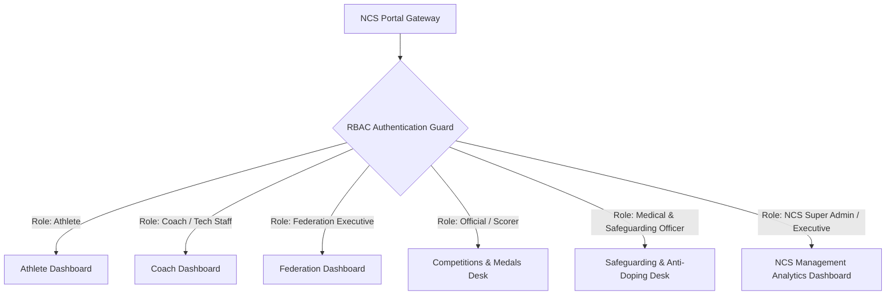
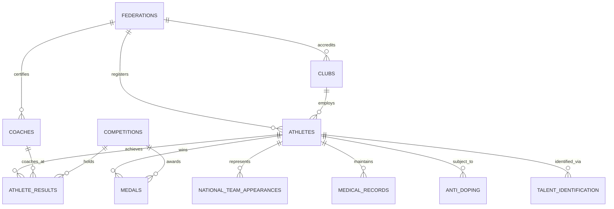

# NAMIS Master Architecture & Database Schema Specification

## 1. Executive Summary
The **National Athlete Management Information System (NAMIS)** is a centralized digital governance framework for the **National Council of Sports (NCS) Uganda**. It tracks athlete master profiles, technical coaching staff, performance records, medals, federations, talent identification pathways, dual career education, medical history, anti-doping compliance, and national team appearances.

NAMIS is built as a multi-tenant dashboard system within `ncsportal`, establishing strict role-based access control (RBAC) across six core dashboards:
1. **Athlete Self-Service Dashboard**
2. **Coach & Technical Staff Dashboard**
3. **Federation & Association Executive Dashboard**
4. **Competitions & Medals Desk**
5. **Medical, Safeguarding & Anti-Doping Desk**
6. **NCS Executive & Management Analytics Dashboard**

---

## 2. System Architecture & Role-Based Access Control (RBAC)



### RBAC Permission Matrix

| Dashboard / Module | Athlete | Coach | Federation Executive | Scorer / Official | Medical / Safeguarding | NCS Super Admin |
| :--- | :---: | :---: | :---: | :---: | :---: | :---: |
| **Personal Profile** | Read/Edit Own | Read Squad | Read Federation | Read | Restricted | Full |
| **Performance & Results** | Read Own | Write Squad | Read/Approve | Write | Read | Full |
| **Medals & Awards** | Read Own | Read Squad | Write/Approve | Write | Read | Full / Audit |
| **Coaching Roster** | Read | Read/Edit Own | Write Federation | Read | Read | Full |
| **Federation Governance** | Read Public | Read | Read/Write Own | Read | Read | Full / Audit |
| **Talent ID Pathways** | Read Own | Write | Write | Read | Read | Full |
| **Medical & Safeguarding** | Restricted | Restricted | Restricted | Restricted | Full | Full (Audited) |
| **Anti-Doping Records** | Read Own | Read Squad | Read Federation | Restricted | Full | Full |
| **NCS KPI Analytics** | - | - | Federation Stats | - | - | Full Executive |

---

## 3. Database Entity Relationship Diagram (ERD)



---

## 4. 15 Core Database Models (PostgreSQL DDL Specification)

### 4.1 `federations` (Master Recognized Bodies)
```sql
CREATE TABLE federations (
    id UUID PRIMARY KEY DEFAULT gen_random_uuid(),
    federation_code VARCHAR(20) UNIQUE NOT NULL,
    name VARCHAR(255) NOT NULL,
    category VARCHAR(50) NOT NULL, -- e.g., Category A (Priority), Category B, etc.
    registration_status VARCHAR(50) DEFAULT 'Fully Recognized',
    president VARCHAR(150),
    general_secretary VARCHAR(150),
    treasurer VARCHAR(150),
    arbitrator VARCHAR(150),
    email VARCHAR(150),
    phone VARCHAR(50),
    headquarters_address TEXT,
    created_at TIMESTAMP WITH TIME ZONE DEFAULT CURRENT_TIMESTAMP,
    updated_at TIMESTAMP WITH TIME ZONE DEFAULT CURRENT_TIMESTAMP
);
```

### 4.2 `clubs` (Clubs, Academies & Institutions)
```sql
CREATE TABLE clubs (
    id UUID PRIMARY KEY DEFAULT gen_random_uuid(),
    federation_id UUID REFERENCES federations(id) ON DELETE CASCADE,
    club_code VARCHAR(30) UNIQUE NOT NULL,
    name VARCHAR(255) NOT NULL,
    district VARCHAR(100) NOT NULL,
    region VARCHAR(50) NOT NULL, -- North, East, Central, West
    contact_person VARCHAR(150),
    email VARCHAR(150),
    phone VARCHAR(50),
    status VARCHAR(50) DEFAULT 'Active',
    created_at TIMESTAMP WITH TIME ZONE DEFAULT CURRENT_TIMESTAMP
);
```

### 4.3 `athletes` (Athlete Master Profile)
```sql
CREATE TABLE athletes (
    id UUID PRIMARY KEY DEFAULT gen_random_uuid(),
    athlete_id VARCHAR(30) UNIQUE NOT NULL, -- Auto-generated NAMIS ID
    nin_passport VARCHAR(50) UNIQUE NOT NULL,
    full_name VARCHAR(255) NOT NULL,
    gender VARCHAR(10) NOT NULL, -- Male, Female
    date_of_birth DATE NOT NULL,
    age_category VARCHAR(20) NOT NULL, -- U10, U12, U15, U17, U20, Senior
    nationality VARCHAR(100) DEFAULT 'Ugandan',
    district_of_origin VARCHAR(100) NOT NULL,
    region VARCHAR(50) NOT NULL, -- North, East, Central, West
    current_residence TEXT,
    parent_names_contacts TEXT,
    phone VARCHAR(50),
    email VARCHAR(150),
    next_of_kin VARCHAR(255),
    emergency_contact VARCHAR(100),
    -- Athlete Classification
    sport_name VARCHAR(100) NOT NULL,
    discipline_event VARCHAR(100) NOT NULL,
    federation_id UUID REFERENCES federations(id),
    club_id UUID REFERENCES clubs(id),
    registration_number VARCHAR(50),
    athlete_status VARCHAR(30) DEFAULT 'Active', -- Active, Injured, Retired, Suspended
    date_registered_federation DATE,
    created_at TIMESTAMP WITH TIME ZONE DEFAULT CURRENT_TIMESTAMP,
    updated_at TIMESTAMP WITH TIME ZONE DEFAULT CURRENT_TIMESTAMP
);
```

### 4.4 `coaches` (Technical Staff Roster)
```sql
CREATE TABLE coaches (
    id UUID PRIMARY KEY DEFAULT gen_random_uuid(),
    coach_id VARCHAR(30) UNIQUE NOT NULL,
    full_name VARCHAR(255) NOT NULL,
    gender VARCHAR(10),
    coaching_role VARCHAR(50) NOT NULL, -- Primary Coach, Assistant, S&C, Physio, Doctor, Nutritionist, Team Manager
    coaching_level_certification VARCHAR(100) NOT NULL, -- e.g., CAF A, World Athletics Level 2
    federation_id UUID REFERENCES federations(id),
    club_id UUID REFERENCES clubs(id),
    phone VARCHAR(50),
    email VARCHAR(150),
    status VARCHAR(30) DEFAULT 'Active',
    created_at TIMESTAMP WITH TIME ZONE DEFAULT CURRENT_TIMESTAMP
);
```

### 4.5 `competitions` (Event Master Registry)
```sql
CREATE TABLE competitions (
    id UUID PRIMARY KEY DEFAULT gen_random_uuid(),
    name VARCHAR(255) NOT NULL,
    competition_level VARCHAR(50) NOT NULL, -- District, Regional, National, East African, African, Commonwealth, Olympic, World Championship
    host_country VARCHAR(100) NOT NULL,
    host_city VARCHAR(100) NOT NULL,
    start_date DATE NOT NULL,
    end_date DATE NOT NULL,
    federation_id UUID REFERENCES federations(id),
    created_at TIMESTAMP WITH TIME ZONE DEFAULT CURRENT_TIMESTAMP
);
```

### 4.6 `athlete_results` (Performance Log)
```sql
CREATE TABLE athlete_results (
    id UUID PRIMARY KEY DEFAULT gen_random_uuid(),
    athlete_id UUID REFERENCES athletes(id) ON DELETE CASCADE,
    competition_id UUID REFERENCES competitions(id) ON DELETE CASCADE,
    coach_id UUID REFERENCES coaches(id),
    event_discipline VARCHAR(100) NOT NULL,
    result_type VARCHAR(30) NOT NULL, -- Time, Distance, Weight, Score, Ranking
    performance_value VARCHAR(50) NOT NULL, -- e.g., '12.45s', '8.12m', '75kg', '3-1'
    position_finished INT,
    is_national_record BOOLEAN DEFAULT FALSE,
    is_personal_best BOOLEAN DEFAULT FALSE,
    is_seasonal_best BOOLEAN DEFAULT FALSE,
    recorded_at TIMESTAMP WITH TIME ZONE DEFAULT CURRENT_TIMESTAMP
);
```

### 4.7 `medals` (Medals & Honors Registry)
```sql
CREATE TABLE medals (
    id UUID PRIMARY KEY DEFAULT gen_random_uuid(),
    athlete_id UUID REFERENCES athletes(id) ON DELETE CASCADE,
    competition_id UUID REFERENCES competitions(id) ON DELETE CASCADE,
    coach_id UUID REFERENCES coaches(id),
    federation_id UUID REFERENCES federations(id),
    medal_type VARCHAR(20) NOT NULL, -- Gold, Silver, Bronze
    event_won VARCHAR(100) NOT NULL,
    date_won DATE NOT NULL,
    is_team_event BOOLEAN DEFAULT FALSE,
    prize_money_awarded NUMERIC(15, 2) DEFAULT 0.00,
    ncs_recognition_status VARCHAR(50) DEFAULT 'Recognized',
    created_at TIMESTAMP WITH TIME ZONE DEFAULT CURRENT_TIMESTAMP
);
```

### 4.8 `national_team_appearances`
```sql
CREATE TABLE national_team_appearances (
    id UUID PRIMARY KEY DEFAULT gen_random_uuid(),
    athlete_id UUID REFERENCES athletes(id) ON DELETE CASCADE,
    team_name VARCHAR(150) NOT NULL, -- e.g., Uganda Cranes, She Cranes, Uganda Olympic Team
    category VARCHAR(50) NOT NULL,
    call_up_date DATE NOT NULL,
    competition_id UUID REFERENCES competitions(id),
    notes TEXT,
    created_at TIMESTAMP WITH TIME ZONE DEFAULT CURRENT_TIMESTAMP
);
```

### 4.9 `medical_records` (Restricted Safeguarding Access)
```sql
CREATE TABLE medical_records (
    id UUID PRIMARY KEY DEFAULT gen_random_uuid(),
    athlete_id UUID REFERENCES athletes(id) ON DELETE CASCADE,
    blood_group VARCHAR(10),
    allergies TEXT,
    injury_history TEXT,
    current_injury_status VARCHAR(50) DEFAULT 'Fit',
    medical_insurance_provider VARCHAR(150),
    insurance_policy_number VARCHAR(100),
    last_examination_date DATE,
    updated_at TIMESTAMP WITH TIME ZONE DEFAULT CURRENT_TIMESTAMP
);
```

### 4.10 `anti_doping` (WADA Compliance Engine)
```sql
CREATE TABLE anti_doping (
    id UUID PRIMARY KEY DEFAULT gen_random_uuid(),
    athlete_id UUID REFERENCES athletes(id) ON DELETE CASCADE,
    testing_status VARCHAR(50) DEFAULT 'In-Competition',
    date_tested DATE,
    test_result VARCHAR(50) DEFAULT 'Negative', -- Negative, Adverse Analytical Finding, Pending
    wada_education_completed BOOLEAN DEFAULT FALSE,
    wada_completion_date DATE,
    suspension_history TEXT,
    created_at TIMESTAMP WITH TIME ZONE DEFAULT CURRENT_TIMESTAMP
);
```

### 4.11 `scholarships` (Dual Career & Financial Support)
```sql
CREATE TABLE scholarships (
    id UUID PRIMARY KEY DEFAULT gen_random_uuid(),
    athlete_id UUID REFERENCES athletes(id) ON DELETE CASCADE,
    school_institution VARCHAR(255) NOT NULL,
    highest_education_level VARCHAR(100),
    scholarship_type VARCHAR(100), -- Government, NCS Talent, University, Secondary
    grant_amount NUMERIC(15, 2) DEFAULT 0.00,
    start_date DATE,
    end_date DATE,
    created_at TIMESTAMP WITH TIME ZONE DEFAULT CURRENT_TIMESTAMP
);
```

### 4.12 `equipment_support`
```sql
CREATE TABLE equipment_support (
    id UUID PRIMARY KEY DEFAULT gen_random_uuid(),
    athlete_id UUID REFERENCES athletes(id) ON DELETE CASCADE,
    equipment_type VARCHAR(150) NOT NULL,
    provided_by VARCHAR(150) DEFAULT 'National Council of Sports',
    date_issued DATE NOT NULL,
    valuation_ugx NUMERIC(15, 2) DEFAULT 0.00,
    status VARCHAR(50) DEFAULT 'Active'
);
```

### 4.13 `talent_identification` (NCS School-to-Elite Pipeline)
```sql
CREATE TABLE talent_identification (
    id UUID PRIMARY KEY DEFAULT gen_random_uuid(),
    athlete_id UUID REFERENCES athletes(id) ON DELETE CASCADE,
    talent_identification_date DATE NOT NULL,
    identified_by VARCHAR(150) NOT NULL, -- Scout Name / NCS Officer
    school_name VARCHAR(255),
    district VARCHAR(100) NOT NULL,
    talent_centre VARCHAR(150),
    talent_category VARCHAR(100),
    recommended_pathway TEXT,
    scholarship_status VARCHAR(50) DEFAULT 'Recommended',
    created_at TIMESTAMP WITH TIME ZONE DEFAULT CURRENT_TIMESTAMP
);
```

### 4.14 `athlete_documents`
```sql
CREATE TABLE athlete_documents (
    id UUID PRIMARY KEY DEFAULT gen_random_uuid(),
    athlete_id UUID REFERENCES athletes(id) ON DELETE CASCADE,
    document_type VARCHAR(100) NOT NULL, -- Passport, Birth Certificate, National ID, Guardian Consent
    file_path TEXT NOT NULL,
    verification_status VARCHAR(50) DEFAULT 'Verified',
    uploaded_at TIMESTAMP WITH TIME ZONE DEFAULT CURRENT_TIMESTAMP
);
```

### 4.15 `safeguarding_records` (Restricted Officer View)
```sql
CREATE TABLE safeguarding_records (
    id UUID PRIMARY KEY DEFAULT gen_random_uuid(),
    athlete_id UUID REFERENCES athletes(id) ON DELETE CASCADE,
    guardian_details TEXT NOT NULL,
    manager_details TEXT,
    safeguarding_officer_assigned VARCHAR(150) NOT NULL,
    consent_forms_signed BOOLEAN DEFAULT TRUE,
    anti_doping_education_status VARCHAR(50) DEFAULT 'Completed',
    incident_logs TEXT,
    updated_at TIMESTAMP WITH TIME ZONE DEFAULT CURRENT_TIMESTAMP
);
```
