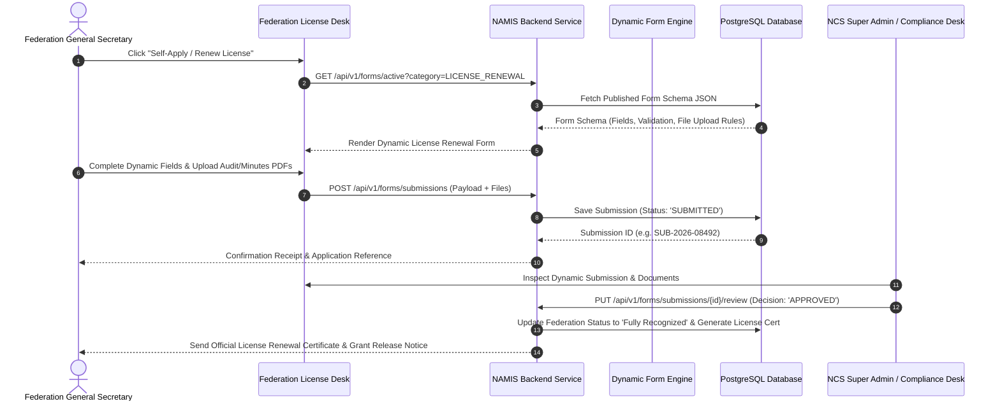

# NAMIS Federation & Association Executive Dashboard Specification

## 1. Overview
The **Federation Executive Dashboard** serves as the administrative command desk for recognized National Sports Associations and Federations in Uganda (e.g., *FUFA*, *UAF*, *UNF*, *UBF*, *FUBA*, *URU*). It manages executive board governance rosters, accredited clubs/academies, national athlete/coach registrations, statutory compliance filings, and annual government grant tracking.

---

## 2. Executive Board Roster & Governance Structure

Every recognized sports federation maintains an executive governance profile on NAMIS:

```
+---------------------------------------------------------------------------------+
|                       FEDERATION EXECUTIVE BOARD ROSTER                         |
+---------------------------------------------------------------------------------+
| 1. President                           | 5. Headquarters & Contact Information  |
| 2. General Secretary                   | 6. Registration Status & Category     |
| 3. Treasurer                           | 7. Number of Accredited Clubs/Academies|
| 4. Arbitrator / Disciplinary Chair     | 8. Total Registered Athletes & Coaches|
+---------------------------------------------------------------------------------+
```

---

## 3. UI Layout & View Structure

```
+-----------------------------------------------------------------------------------+
|  [NCS Logo]  FEDERATION ADMINISTRATION DESK    [Federation Switcher] [Dark] [GS]  |
+-----------------------------------------------------------------------------------+
| [Sidebar Navigation Menu]                                                         |
|  Overview                                                                       |
|  Federation Licenses [v]                                                         |
|    ├── Active License & Status                                                    |
|    ├── Self-Apply / Renew License (Dynamic Form)                                  |
|    ├── License History & Renewals                                                 |
|    ├── NCS Recognition Certificates                                               |
|    └── Licensing Compliance Requirements                                          |
|  Governance & Executive Board [v]                                                |
|    ├── Executive Roster (President, GS, Treasurer, Arbitrator)                   |
|    ├── General Assembly Minutes                                                   |
|    ├── Elections & Term Certificates                                              |
|    └── Constitutional Documents                                                   |
|  Clubs & Affiliates Desk [v]                                                    |
|    ├── Accredited Sports Clubs                                                    |
|    ├── Regional Associations                                                      |
|    ├── School & University Academies                                              |
|    └── Register New Club                                                          |
|   Athletes & Squad Roster [v]                                                     |
|    ├── Master Athlete Directory                                                   |
|    ├── Athlete Registrations & Transfers                                          |
|    └── National Squad Selections                                                  |
|  Coaches & Entourage [v]                                                         |
|    ├── Licensed Coaches Roster                                                    |
|    ├── Technical Entourage Staff                                                  |
|    └── Coaching Certification Verification                                        |
|  Statutory Grants & Finance [v]                                                 |
|    ├── NCS Annual Grant Allocations                                               |
|    ├── Audited Financial Statements                                               |
|    └── Budget & Expenditure Approvals                                             |
+-----------------------------------------------------------------------------------+

```

---

## 4. Key Administrative Functions

### 4.1 Master List of Recognized Federations
* Central database of recognized national federations organized by category:
  - **Category A (Priority)**: *Athletics*, *Football*, *Netball*, *Boxing*, *Basketball*, *Rugby*.
  - **Category B (Established)**: *Swimming*, *Badminton*, *Table Tennis*, *Volleyball*, *Cycling*, *Motorsport*.
  - **Category C (Developmental)**: *Woodball*, *Floorball*, *Squash*, *Chess*, *Ludo*.

### 4.2 Club & Academy Accreditation Desk
* Add and manage local sports clubs, school academies, and regional sub-associations.
* Assign geographic districts (e.g. *Arua*, *Gulu*, *Jinja*, *Masaka*, *Mbarara*) and regions.

### 4.3 Federation License Self-Application & Dynamic Renewal Desk
* **Dynamic Form Rendering Engine**: When a federation clicks `Self-Apply / Renew License`, the system fetches `GET /api/v1/forms/active?category=LICENSE_RENEWAL` and dynamically builds the form fields (text inputs, checkboxes, document dropzones) configured by the NCS Super Admin.
* **Self-Application Data Payload**:
  - Executive Board Member Details (President, GS, Treasurer, Arbitrator).
  - Registered Clubs & Active Athlete Counts.
  - Required Dynamic File Uploads:
    1. Audited Financial Statements (PDF).
    2. Annual General Assembly Minutes & Resolutions (PDF).
    3. Updated Federation Constitution (PDF).
    4. Tax Compliance & Bank Account Verification (PDF).
* **Submission State Machine**:
  - `DRAFT`: Saved progress prior to final submission.
  - `SUBMITTED`: Form submitted to NCS Technical & Compliance Officers.
  - `UNDER_REVIEW`: In review by NCS Legal / Technical Committee.
  - `APPROVED_LICENSED`: License issued with auto-generated Certificate of Recognition.
  - `REJECTED_REVISION`: Sent back to federation with officer notes for correction.

---

## 5. Data Flow & Dynamic Form Application Sequence Diagram



