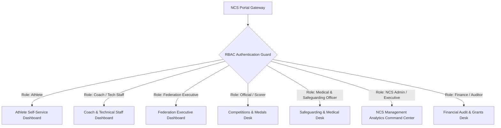
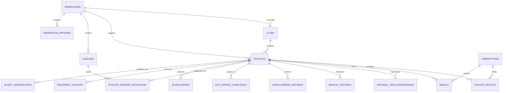
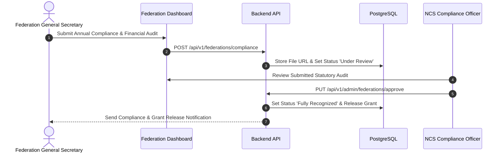

# NAMIS Master Comprehensive Implementation & Technical Architecture Specification

## 1. Executive Summary & Legal Mandate

The **National Athlete Management Information System (NAMIS)** is the official centralized digital governance and technical operations framework for the **National Council of Sports (NCS) Uganda**, operating under the Ministry of Education and Sports.

### 1.1 Legal Mandate (National Sports Act, 2023)
Pursuant to the **National Sports Act, 2023**, the National Council of Sports is mandated to develop, promote, and regulate all sports activities in Uganda. NAMIS fulfills statutory duties including:
1. **Federation & Association Registration**: Maintaining official registers of recognized National Sports Organisations and Federations.
2. **Athlete & Technical Roster Tracking**: Regulating athlete registrations, coaching certifications, and entourage personnel across recognized sports disciplines.
3. **Talent Search & Grass-Roots Pathways**: Identifying, scouting, and developing sporting talent from school competitions through regional talent centers to elite national teams.
4. **Awards, Medals & Incentives**: Sanctioning competitions, verifying international medal wins, managing prize money, and awarding national honours.
5. **Government Grant & Financial Oversight**: Approving and monitoring expenditure of government funds and statutory grants disbursed to federations.
6. **International Representation**: Facilitating Ugandan national team participation in regional, continental, and global games (East African, African, Commonwealth, Olympic, World Championships).
7. **Safeguarding, Health & Anti-Doping**: Enforcing child protection, guardian consent, medical clearance, and WADA anti-doping compliance.

### 1.2 Vision, Mission & Guiding Core Values
* **Vision**: *"A centre of excellence for promotion and development of Sports."*
* **Mission**: *"Maximizing opportunities for all Ugandans to participate and excel in Sports."*
* **Core Values**:
  1. **Honesty**: Truthfulness, integrity, loyalty, and fair play.
  2. **Pursuit of Personal Excellence**: Hard work, continuous improvement, and goal fulfillment.
  3. **Love of Sport**: Promoting physical fitness, mental health, and community unity.
  4. **Teamwork**: Collaborative effort driving high institutional performance.
  5. **Inclusiveness**: Equal access and resources for all, including para-athletes and underrepresented groups.

---

## 2. System Architecture & Role-Based Access Control (RBAC)

NAMIS operates as a multi-tenant dashboard system inside `ncsportal`, utilizing a Go REST API backend, a PostgreSQL relational database, and a Vue 3 / HTML5 frontend layer.



### 2.1 Fine-Grained Security Role Definitions

1. **`ncs_general_secretary`**: Cross-federation executive oversight, council reporting, grant approval reviews, and executive dashboards.
2. **`technical_department`**: Technical audits, performance verification, talent pipeline oversight, and coaching license validation.
3. **`finance_department`**: Government grant disbursement audits, financial reporting, and equipment valuation logs.
4. **`federation_president`**: Executive approval of federation annual filings, compliance documents, and board rosters.
5. **`federation_general_secretary`**: Daily administration of athlete registrations, club accreditations, squad selections, and tournament entries.
6. **`safeguarding_officer`**: Role-restricted access to confidential medical histories, minor guardian consent forms, and anti-doping records.
7. **`auditor`**: Read-only access for compliance, statutory checks, and financial audit trails.
8. **`athlete`**: Self-service profile inspection, results viewing, dual-career tracking, and equipment grant confirmation.
9. **`coach`**: Squad management, result logging, technical entourage configuration, and qualification uploads.

### 2.2 System-Wide RBAC Permission Matrix

| Dashboard / Resource Module | Athlete | Coach | Federation GS / Pres | Official / Scorer | Safeguarding Officer | Finance / Auditor | NCS Super Admin |
| :--- | :---: | :---: | :---: | :---: | :---: | :---: | :---: |
| **Athlete Personal Profile** | Read/Edit Own | Read Squad | Read/Write Own | Read | Restricted | Read | Full |
| **Dual Career & Education** | Read/Edit Own | Read Squad | Read/Write | Read | Read | Read | Full |
| **Performance & Results** | Read Own | Write Squad | Read/Approve | Write | Read | Read | Full |
| **Medals & Awards** | Read Own | Read Squad | Write/Approve | Write | Read | Audit | Full / Sanction |
| **Coaching & Entourage Roster** | Read | Read/Edit Own | Write Federation | Read | Read | Read | Full |
| **Federation Governance & Clubs** | Read Public | Read | Read/Write Own | Read | Read | Audit | Full |
| **Talent ID & Pathways** | Read Own | Write Squad | Write | Read | Read | Read | Full |
| **Medical Records (RESTRICTED)** | Read Own | Restricted | Restricted | Restricted | Full Access | Restricted | Audited Admin |
| **Safeguarding & Consent** | Read Own | Restricted | Restricted | Restricted | Full Access | Restricted | Audited Admin |
| **Anti-Doping Compliance** | Read Own | Read Squad | Read Federation | Restricted | Full Access | Read | Full |
| **NCS Executive KPI Analytics** | - | - | Federation Stats | - | - | Financial Stats | Full Command |

---

## 3. Database ERD & 15 Complete PostgreSQL DDL Schemas



### 3.1 `federations` (Recognized Bodies) & Officers

```sql
CREATE TABLE IF NOT EXISTS federations (
    id UUID PRIMARY KEY DEFAULT gen_random_uuid(),
    federation_code VARCHAR(20) UNIQUE NOT NULL,
    name VARCHAR(255) NOT NULL,
    acronym VARCHAR(50) NOT NULL,
    category VARCHAR(50) NOT NULL CHECK (category IN ('CATEGORY_A_PRIORITY', 'CATEGORY_B_ESTABLISHED', 'CATEGORY_C_DEVELOPMENTAL')),
    registration_status VARCHAR(50) DEFAULT 'Fully Recognized' CHECK (registration_status IN ('Fully Recognized', 'Provisional', 'Suspended')),
    ncs_registration_number VARCHAR(100) UNIQUE,
    physical_address TEXT,
    email VARCHAR(150),
    phone VARCHAR(50),
    website VARCHAR(150),
    created_at TIMESTAMP WITH TIME ZONE DEFAULT CURRENT_TIMESTAMP,
    updated_at TIMESTAMP WITH TIME ZONE DEFAULT CURRENT_TIMESTAMP
);

CREATE TABLE IF NOT EXISTS federation_officers (
    id UUID PRIMARY KEY DEFAULT gen_random_uuid(),
    federation_id UUID REFERENCES federations(id) ON DELETE CASCADE,
    position VARCHAR(100) NOT NULL CHECK (position IN ('President', 'General Secretary', 'Treasurer', 'Arbitrator', 'Technical Director')),
    full_name VARCHAR(255) NOT NULL,
    email VARCHAR(150),
    phone VARCHAR(50),
    appointed_on DATE NOT NULL,
    term_ends_on DATE,
    is_active BOOLEAN DEFAULT TRUE,
    created_at TIMESTAMP WITH TIME ZONE DEFAULT CURRENT_TIMESTAMP
);
```

### 3.2 `clubs` (Clubs, Academies & Institutions)

```sql
CREATE TABLE IF NOT EXISTS clubs (
    id UUID PRIMARY KEY DEFAULT gen_random_uuid(),
    federation_id UUID NOT NULL REFERENCES federations(id) ON DELETE RESTRICT,
    club_code VARCHAR(30) UNIQUE NOT NULL,
    name VARCHAR(255) NOT NULL,
    acronym VARCHAR(50) NOT NULL,
    district VARCHAR(100) NOT NULL,
    region VARCHAR(50) NOT NULL CHECK (region IN ('Central', 'North', 'East', 'West')),
    contact_person VARCHAR(150),
    email VARCHAR(150),
    phone VARCHAR(50),
    date_founded DATE,
    status VARCHAR(50) DEFAULT 'ACTIVE' CHECK (status IN ('ACTIVE', 'INACTIVE', 'SUSPENDED')),
    created_at TIMESTAMP WITH TIME ZONE DEFAULT CURRENT_TIMESTAMP,
    updated_at TIMESTAMP WITH TIME ZONE DEFAULT CURRENT_TIMESTAMP,
    deleted_at TIMESTAMP WITH TIME ZONE
);

CREATE UNIQUE INDEX IF NOT EXISTS uq_clubs_acronym_federation ON clubs(LOWER(acronym), federation_id) WHERE deleted_at IS NULL;
CREATE INDEX IF NOT EXISTS idx_clubs_federation ON clubs(federation_id) WHERE deleted_at IS NULL;
```

### 3.3 `athletes` (Athlete Master Profile)

```sql
CREATE TABLE IF NOT EXISTS athletes (
    id UUID PRIMARY KEY DEFAULT gen_random_uuid(),
    athlete_id VARCHAR(30) UNIQUE NOT NULL, -- NAMIS Auto-generated Code (e.g., NAMIS-UG-2026-08492)
    national_id_passport VARCHAR(50) UNIQUE NOT NULL,
    full_name VARCHAR(255) NOT NULL,
    gender VARCHAR(10) NOT NULL CHECK (gender IN ('Male', 'Female')),
    date_of_birth DATE NOT NULL,
    age_category VARCHAR(20) NOT NULL CHECK (age_category IN ('U10', 'U12', 'U15', 'U17', 'U20', 'Senior')),
    nationality VARCHAR(100) DEFAULT 'Ugandan',
    district_of_origin VARCHAR(100) NOT NULL,
    region VARCHAR(50) NOT NULL CHECK (region IN ('Central', 'North', 'East', 'West')),
    current_residence TEXT,
    parent_details JSONB DEFAULT '{}'::JSONB, -- Parent names and phone contacts
    phone_contact VARCHAR(50),
    email_address VARCHAR(150),
    next_of_kin VARCHAR(255),
    emergency_contact VARCHAR(100),
    -- Athlete Classification
    sport_name VARCHAR(100) NOT NULL,
    discipline_event VARCHAR(100) NOT NULL,
    federation_id UUID REFERENCES federations(id),
    club_id UUID REFERENCES clubs(id),
    registration_number VARCHAR(50),
    athlete_status VARCHAR(30) DEFAULT 'Active' CHECK (athlete_status IN ('Active', 'Injured', 'Retired', 'Suspended')),
    date_registered_federation DATE,
    -- Dual Career & Education
    education_institution VARCHAR(255),
    highest_education_level VARCHAR(100) CHECK (highest_education_level IN ('Primary', 'O-Level', 'A-Level', 'Diploma', 'Bachelors', 'Masters', 'None')),
    sports_scholarship_status BOOLEAN DEFAULT FALSE,
    current_occupation VARCHAR(150),
    created_at TIMESTAMP WITH TIME ZONE DEFAULT CURRENT_TIMESTAMP,
    updated_at TIMESTAMP WITH TIME ZONE DEFAULT CURRENT_TIMESTAMP
);
```

### 3.4 `coaches` & `athlete_support_entourage`

```sql
CREATE TABLE IF NOT EXISTS coaches (
    id UUID PRIMARY KEY DEFAULT gen_random_uuid(),
    coach_id VARCHAR(30) UNIQUE NOT NULL,
    full_name VARCHAR(255) NOT NULL,
    gender VARCHAR(10),
    coaching_role VARCHAR(50) NOT NULL DEFAULT 'Primary Coach',
    certification_level VARCHAR(100) NOT NULL, -- e.g., CAF A, World Athletics Level 3
    license_number VARCHAR(100) UNIQUE,
    expiry_date DATE,
    federation_id UUID REFERENCES federations(id),
    club_id UUID REFERENCES clubs(id),
    phone VARCHAR(50),
    email VARCHAR(150),
    status VARCHAR(30) DEFAULT 'Active' CHECK (status IN ('Active', 'Suspended', 'Expired')),
    created_at TIMESTAMP WITH TIME ZONE DEFAULT CURRENT_TIMESTAMP
);

CREATE TABLE IF NOT EXISTS athlete_support_entourage (
    id UUID PRIMARY KEY DEFAULT gen_random_uuid(),
    athlete_id UUID NOT NULL UNIQUE REFERENCES athletes(id) ON DELETE CASCADE,
    primary_coach_id UUID REFERENCES coaches(id) ON DELETE SET NULL,
    assistant_coach_name VARCHAR(255) DEFAULT '',
    strength_conditioning_coach VARCHAR(255) DEFAULT '',
    sports_scientist VARCHAR(255) DEFAULT '',
    physiotherapist VARCHAR(255) DEFAULT '',
    team_doctor VARCHAR(255) DEFAULT '',
    sports_nutritionist VARCHAR(255) DEFAULT '',
    team_manager VARCHAR(255) DEFAULT '',
    created_at TIMESTAMP WITH TIME ZONE DEFAULT CURRENT_TIMESTAMP,
    updated_at TIMESTAMP WITH TIME ZONE DEFAULT CURRENT_TIMESTAMP
);
```

### 3.5 `competitions`, `athlete_results` & `medals`

```sql
CREATE TABLE IF NOT EXISTS competitions (
    id UUID PRIMARY KEY DEFAULT gen_random_uuid(),
    name VARCHAR(255) NOT NULL,
    level VARCHAR(50) NOT NULL CHECK (level IN ('DISTRICT', 'REGIONAL', 'NATIONAL', 'EAST_AFRICAN', 'AFRICAN', 'COMMONWEALTH', 'OLYMPIC', 'WORLD_CHAMPIONSHIP')),
    host_country VARCHAR(100) NOT NULL,
    host_city VARCHAR(100) NOT NULL,
    starts_on DATE NOT NULL,
    ends_on DATE NOT NULL,
    federation_id UUID REFERENCES federations(id),
    created_at TIMESTAMP WITH TIME ZONE DEFAULT CURRENT_TIMESTAMP
);

CREATE TABLE IF NOT EXISTS athlete_results (
    id UUID PRIMARY KEY DEFAULT gen_random_uuid(),
    athlete_id UUID REFERENCES athletes(id) ON DELETE CASCADE,
    competition_id UUID REFERENCES competitions(id) ON DELETE CASCADE,
    coach_id UUID REFERENCES coaches(id),
    event_discipline VARCHAR(100) NOT NULL,
    result_type VARCHAR(30) NOT NULL CHECK (result_type IN ('Time', 'Distance', 'Weight', 'Score', 'Ranking')),
    performance_value VARCHAR(50) NOT NULL, -- e.g., '12:45.10', '8.12m', '75kg', '3-1'
    time_result VARCHAR(50) DEFAULT '',
    distance_result VARCHAR(50) DEFAULT '',
    weight_result VARCHAR(50) DEFAULT '',
    score_result VARCHAR(50) DEFAULT '',
    ranking_result VARCHAR(50) DEFAULT '',
    position_finished INT,
    is_national_record BOOLEAN DEFAULT FALSE,
    is_personal_best BOOLEAN DEFAULT FALSE,
    is_seasonal_best BOOLEAN DEFAULT FALSE,
    recorded_at TIMESTAMP WITH TIME ZONE DEFAULT CURRENT_TIMESTAMP
);

CREATE TABLE IF NOT EXISTS medals (
    id UUID PRIMARY KEY DEFAULT gen_random_uuid(),
    athlete_id UUID REFERENCES athletes(id) ON DELETE CASCADE,
    competition_id UUID REFERENCES competitions(id) ON DELETE CASCADE,
    coach_at_win_id UUID REFERENCES coaches(id) ON DELETE SET NULL,
    federation_id UUID REFERENCES federations(id),
    medal_type VARCHAR(20) NOT NULL CHECK (medal_type IN ('Gold', 'Silver', 'Bronze')),
    event_won VARCHAR(100) NOT NULL,
    level VARCHAR(50) NOT NULL DEFAULT 'NATIONAL' CHECK (level IN ('DISTRICT', 'REGIONAL', 'NATIONAL', 'EAST_AFRICAN', 'AFRICAN', 'COMMONWEALTH', 'OLYMPIC', 'WORLD_CHAMPIONSHIP')),
    won_on DATE NOT NULL,
    is_team_event BOOLEAN DEFAULT FALSE,
    prize_money NUMERIC(18,2) DEFAULT 0.00,
    ncs_recognition_status VARCHAR(50) DEFAULT 'PENDING' CHECK (ncs_recognition_status IN ('PENDING', 'APPROVED', 'REJECTED')),
    created_at TIMESTAMP WITH TIME ZONE DEFAULT CURRENT_TIMESTAMP
);
```

### 3.6 `national_team_appearances`

```sql
CREATE TABLE IF NOT EXISTS national_team_appearances (
    id UUID PRIMARY KEY DEFAULT gen_random_uuid(),
    athlete_id UUID NOT NULL REFERENCES athletes(id) ON DELETE CASCADE,
    team_name VARCHAR(150) NOT NULL, -- e.g., Uganda Cranes, She Cranes, Uganda Olympic Squad
    category VARCHAR(50) NOT NULL CHECK (category IN ('SENIOR', 'DEVELOPMENT', 'JUNIOR')),
    first_call_up_on DATE,
    last_appearance_on DATE,
    appearances_count INT NOT NULL DEFAULT 1 CHECK (appearances_count >= 1),
    notes TEXT DEFAULT '',
    created_at TIMESTAMP WITH TIME ZONE DEFAULT CURRENT_TIMESTAMP,
    updated_at TIMESTAMP WITH TIME ZONE DEFAULT CURRENT_TIMESTAMP,
    UNIQUE(athlete_id, team_name, category)
);
```

### 3.7 Medical, Safeguarding & Anti-Doping (RESTRICTED SCHEMAS)

```sql
CREATE TABLE IF NOT EXISTS medical_records (
    id UUID PRIMARY KEY DEFAULT gen_random_uuid(),
    athlete_id UUID NOT NULL UNIQUE REFERENCES athletes(id) ON DELETE CASCADE,
    blood_group VARCHAR(10),
    allergies TEXT,
    injury_history TEXT,
    current_injury_status VARCHAR(50) DEFAULT 'FIT' CHECK (current_injury_status IN ('FIT', 'INJURED', 'RECOVERING')),
    medical_insurance_provider VARCHAR(150),
    insurance_policy_number VARCHAR(100),
    last_examination_date DATE,
    updated_at TIMESTAMP WITH TIME ZONE DEFAULT CURRENT_TIMESTAMP
);

CREATE TABLE IF NOT EXISTS safeguarding_records (
    id UUID PRIMARY KEY DEFAULT gen_random_uuid(),
    athlete_id UUID NOT NULL UNIQUE REFERENCES athletes(id) ON DELETE CASCADE,
    guardian_details JSONB DEFAULT '{}'::JSONB,
    manager_details JSONB DEFAULT '{}'::JSONB,
    safeguarding_officer_assigned VARCHAR(150),
    consent_forms_url TEXT,
    anti_doping_education_completed BOOLEAN DEFAULT FALSE,
    incident_logs TEXT,
    updated_at TIMESTAMP WITH TIME ZONE DEFAULT CURRENT_TIMESTAMP
);

CREATE TABLE IF NOT EXISTS anti_doping_compliance (
    id UUID PRIMARY KEY DEFAULT gen_random_uuid(),
    athlete_id UUID NOT NULL UNIQUE REFERENCES athletes(id) ON DELETE CASCADE,
    testing_status VARCHAR(50) DEFAULT 'NOT_TESTED' CHECK (testing_status IN ('NOT_TESTED', 'IN_POOL', 'TESTED')),
    last_tested_on DATE,
    last_test_result VARCHAR(50) DEFAULT 'NEGATIVE' CHECK (last_test_result IN ('NEGATIVE', 'PENDING', 'ADVERSE_FINDING')),
    wada_education_completed BOOLEAN DEFAULT FALSE,
    wada_completion_date DATE,
    suspension_history TEXT,
    created_at TIMESTAMP WITH TIME ZONE DEFAULT CURRENT_TIMESTAMP,
    updated_at TIMESTAMP WITH TIME ZONE DEFAULT CURRENT_TIMESTAMP
);
```

### 3.8 Talent Identification, Scholarships & Equipment

```sql
CREATE TABLE IF NOT EXISTS talent_records (
    id UUID PRIMARY KEY DEFAULT gen_random_uuid(),
    athlete_id UUID REFERENCES athletes(id) ON DELETE CASCADE,
    federation_id UUID REFERENCES federations(id),
    athlete_name VARCHAR(255) NOT NULL,
    age_at_identification INT NOT NULL,
    identified_by VARCHAR(150) NOT NULL,
    identified_on DATE NOT NULL,
    school VARCHAR(255),
    district VARCHAR(100) NOT NULL,
    region VARCHAR(50) NOT NULL,
    talent_centre VARCHAR(150),
    talent_category VARCHAR(50) DEFAULT 'AMATEUR' CHECK (talent_category IN ('AMATEUR', 'EMERGING', 'ELITE')),
    recommended_pathway TEXT,
    scholarship_status VARCHAR(50) DEFAULT 'NONE' CHECK (scholarship_status IN ('NONE', 'APPLIED', 'ACTIVE', 'EXPIRED')),
    created_at TIMESTAMP WITH TIME ZONE DEFAULT CURRENT_TIMESTAMP
);

CREATE TABLE IF NOT EXISTS scholarships (
    id UUID PRIMARY KEY DEFAULT gen_random_uuid(),
    athlete_id UUID REFERENCES athletes(id) ON DELETE CASCADE,
    talent_record_id UUID REFERENCES talent_records(id) ON DELETE CASCADE,
    institution VARCHAR(255) NOT NULL,
    scholarship_type VARCHAR(100) DEFAULT 'Government Grant',
    grant_amount NUMERIC(15,2) DEFAULT 0.00,
    starts_on DATE NOT NULL,
    ends_on DATE,
    status VARCHAR(50) DEFAULT 'ACTIVE',
    created_at TIMESTAMP WITH TIME ZONE DEFAULT CURRENT_TIMESTAMP
);

CREATE TABLE IF NOT EXISTS equipment_support (
    id UUID PRIMARY KEY DEFAULT gen_random_uuid(),
    athlete_id UUID NOT NULL REFERENCES athletes(id) ON DELETE CASCADE,
    equipment_type VARCHAR(150) NOT NULL,
    provided_by VARCHAR(150) DEFAULT 'National Council of Sports',
    date_issued DATE NOT NULL,
    valuation_ugx NUMERIC(15,2) DEFAULT 0.00,
    status VARCHAR(50) DEFAULT 'ACTIVE'
);
```

### 3.9 Dynamic Forms Engine (Schemas & Submissions)

```sql
CREATE TABLE IF NOT EXISTS dynamic_form_schemas (
    id UUID PRIMARY KEY DEFAULT gen_random_uuid(),
    form_code VARCHAR(100) UNIQUE NOT NULL, -- e.g. FORM_FED_LICENSE_RENEWAL_2026
    title VARCHAR(255) NOT NULL,
    description TEXT,
    category VARCHAR(100) NOT NULL CHECK (category IN ('LICENSE_RENEWAL', 'CLUB_ACCREDITATION', 'INTERNATIONAL_TOUR_SANCTION', 'TALENT_GRANT', 'GENERAL_COMPLIANCE')),
    version VARCHAR(20) NOT NULL DEFAULT 'v1.0',
    schema_json JSONB NOT NULL DEFAULT '[]'::JSONB, -- Array of field definitions (name, label, type, required, options, mime_types)
    is_active BOOLEAN DEFAULT TRUE,
    published_at TIMESTAMP WITH TIME ZONE DEFAULT CURRENT_TIMESTAMP,
    created_by UUID REFERENCES users(id) ON DELETE SET NULL,
    created_at TIMESTAMP WITH TIME ZONE DEFAULT CURRENT_TIMESTAMP,
    updated_at TIMESTAMP WITH TIME ZONE DEFAULT CURRENT_TIMESTAMP
);

CREATE TABLE IF NOT EXISTS dynamic_form_submissions (
    id UUID PRIMARY KEY DEFAULT gen_random_uuid(),
    form_schema_id UUID NOT NULL REFERENCES dynamic_form_schemas(id) ON DELETE RESTRICT,
    federation_id UUID REFERENCES federations(id) ON DELETE CASCADE,
    submitting_user_id UUID NOT NULL REFERENCES users(id) ON DELETE RESTRICT,
    submission_reference VARCHAR(100) UNIQUE NOT NULL, -- e.g. SUB-2026-08492
    payload_json JSONB NOT NULL DEFAULT '{}'::JSONB, -- Dynamic response answers
    attachments_json JSONB DEFAULT '[]'::JSONB, -- Array of uploaded file URLs & file metadata
    status VARCHAR(50) DEFAULT 'SUBMITTED' CHECK (status IN ('DRAFT', 'SUBMITTED', 'UNDER_REVIEW', 'APPROVED_LICENSED', 'REJECTED_REVISION')),
    reviewer_user_id UUID REFERENCES users(id) ON DELETE SET NULL,
    reviewer_notes TEXT,
    reviewed_at TIMESTAMP WITH TIME ZONE,
    submitted_at TIMESTAMP WITH TIME ZONE DEFAULT CURRENT_TIMESTAMP,
    updated_at TIMESTAMP WITH TIME ZONE DEFAULT CURRENT_TIMESTAMP
);

CREATE INDEX IF NOT EXISTS idx_form_submissions_federation ON dynamic_form_submissions(federation_id);
CREATE INDEX IF NOT EXISTS idx_form_submissions_status ON dynamic_form_submissions(status);
```

---


## 4. Go Backend Architecture & Generic Repository Mappings

The backend leverages `NSMISRepo` generic repository mapping framework in `backend/internal/repository/nsmis_domains.go`.

### 4.1 Generic Domain Mappings (`nsmis_domains.go`)

```go
// Extended Domain Definitions in nsmis_domains.go

"athletes": {
    "athletes",
    "EXISTS(SELECT 1 FROM athlete_affiliations aa WHERE aa.athlete_id=t.id AND aa.federation_id=ANY($3))",
    []string{"full_name", "gender", "date_of_birth", "sport_name", "discipline_event"},
    map[string]string{
        "athlete_id": "text", "national_id_passport": "text", "full_name": "text", "gender": "text",
        "date_of_birth": "date", "age_category": "text", "district_of_origin": "text", "region": "text",
        "phone_contact": "text", "email_address": "text", "sport_name": "text", "discipline_event": "text",
        "athlete_status": "text", "education_institution": "text", "highest_education_level": "text",
        "sports_scholarship_status": "boolean", "current_occupation": "text",
    },
},
"clubs": {
    "clubs",
    "t.federation_id=ANY($3)",
    []string{"federation_id", "name", "acronym"},
    map[string]string{
        "federation_id": "text", "name": "text", "acronym": "text", "contact_person": "text",
        "email": "text", "phone": "text", "district": "text", "region": "text", "date_founded": "date?", "status": "text",
    },
},
"coaches": {
    "coaches",
    "t.federation_id=ANY($3)",
    []string{"federation_id", "full_name", "certification_level", "license_number"},
    map[string]string{
        "federation_id": "text", "full_name": "text", "coaching_role": "text", "certification_level": "text",
        "license_number": "text", "expiry_date": "date?", "phone": "text", "email": "text", "status": "text",
    },
},
"athlete-support-entourage": {
    "athlete_support_entourage",
    "EXISTS(SELECT 1 FROM athletes a WHERE a.id=t.athlete_id AND a.federation_id=ANY($3))",
    []string{"athlete_id"},
    map[string]string{
        "athlete_id": "text", "primary_coach_id": "text?", "assistant_coach_name": "text",
        "strength_conditioning_coach": "text", "sports_scientist": "text", "physiotherapist": "text",
        "team_doctor": "text", "sports_nutritionist": "text", "team_manager": "text",
    },
},
"national-team": {
    "national_team_appearances",
    "EXISTS(SELECT 1 FROM athletes a WHERE a.id=t.athlete_id AND a.federation_id=ANY($3))",
    []string{"athlete_id", "team_name", "category"},
    map[string]string{
        "athlete_id": "text", "team_name": "text", "category": "text", "first_call_up_on": "date?",
        "last_appearance_on": "date?", "appearances_count": "integer", "notes": "text",
    },
},
"competitions": {
    "competitions", "t.federation_id=ANY($3)",
    []string{"federation_id", "name", "level", "starts_on", "ends_on"},
    map[string]string{"federation_id": "text", "name": "text", "host_country": "text", "host_city": "text", "level": "text", "starts_on": "date", "ends_on": "date"},
},
"medals": {
    "medals", "t.federation_id=ANY($3)",
    []string{"competition_id", "federation_id", "athlete_id", "medal_type"},
    map[string]string{
        "competition_id": "text", "federation_id": "text", "athlete_id": "text", "medal_type": "text",
        "event_won": "text", "level": "text", "won_on": "date", "coach_at_win_id": "text?",
        "is_team_event": "boolean", "prize_money": "numeric", "ncs_recognition_status": "text",
    },
},
"competition-results": {
    "athlete_results",
    "EXISTS(SELECT 1 FROM competitions c WHERE c.id=t.competition_id AND c.federation_id=ANY($3))",
    []string{"competition_id", "athlete_id", "event_discipline"},
    map[string]string{
        "athlete_id": "text", "competition_id": "text", "coach_id": "text?", "event_discipline": "text",
        "result_type": "text", "performance_value": "text", "position_finished": "integer?",
        "is_national_record": "boolean", "is_personal_best": "boolean", "is_seasonal_best": "boolean",
    },
},
"talent": {
    "talent_records", "t.federation_id=ANY($3)",
    []string{"federation_id", "athlete_name", "district", "identified_by"},
    map[string]string{
        "federation_id": "text", "athlete_id": "text?", "athlete_name": "text", "age_at_identification": "integer",
        "school": "text", "district": "text", "region": "text", "identified_by": "text", "identified_on": "date",
        "talent_centre": "text", "talent_category": "text", "recommended_pathway": "text", "scholarship_status": "text",
    },
},
"scholarships": {
    "scholarships",
    "EXISTS(SELECT 1 FROM athletes a WHERE a.id=t.athlete_id AND a.federation_id=ANY($3))",
    []string{"athlete_id", "institution", "starts_on"},
    map[string]string{
        "athlete_id": "text", "talent_record_id": "text?", "institution": "text", "scholarship_type": "text",
        "grant_amount": "numeric", "starts_on": "date", "ends_on": "date?", "status": "text",
    },
},
"form-schemas": {
    "dynamic_form_schemas", "t.is_active=TRUE",
    []string{"form_code", "title", "category", "version"},
    map[string]string{
        "form_code": "text", "title": "text", "description": "text", "category": "text",
        "version": "text", "schema_json": "jsonb", "is_active": "boolean",
    },
},
"form-submissions": {
    "dynamic_form_submissions",
    "t.federation_id=ANY($3)",
    []string{"form_schema_id", "federation_id", "submission_reference", "status"},
    map[string]string{
        "form_schema_id": "text", "federation_id": "text", "submitting_user_id": "text",
        "submission_reference": "text", "payload_json": "jsonb", "attachments_json": "jsonb",
        "status": "text", "reviewer_user_id": "text?", "reviewer_notes": "text",
    },
},
```

### 4.2 API Router Configuration (`cmd/server/main.go`)

To expose generic endpoints dynamically for the new resources:
```go
r.Route("/api/v1/nsmis/{resource:athletes|clubs|coaches|athlete-support-entourage|national-team|competitions|medals|competition-results|talent|scholarships|form-schemas|form-submissions}", func(r chi.Router) {
    r.Get("/", h.NSMIS.List)
    r.Post("/", h.NSMIS.Create)
    r.Get("/{id}", h.NSMIS.GetByID)
    r.Put("/{id}", h.NSMIS.Update)
    r.Delete("/{id}", h.NSMIS.Delete)
})

// Dedicated Dynamic Forms API Routes
r.Route("/api/v1/forms", func(r chi.Router) {
    r.Get("/active", h.Forms.GetActiveSchemaByCategory) // e.g. GET /api/v1/forms/active?category=LICENSE_RENEWAL
    r.Post("/submissions", h.Forms.SubmitForm)         // Federation Self-Application Submission
    r.Get("/submissions/{id}", h.Forms.GetSubmission)  // Fetch Submission & Answers
    r.Put("/submissions/{id}/review", h.Forms.ReviewSubmission) // Super Admin Approve/Reject
})
```


---

### 5. 6 Core Dashboard Specifications, UI Layouts & Dropdown Navigation Menus

To provide a consistent and intuitive user interface across all multi-tenant dashboards, each module features a structured sidebar navigation menu with collapsible dropdown submenus.

### 5.0 Global Dashboard Navigation & Dropdown Submenu Specification

#### A. Federation Executive Dashboard Navigation
- **📊 Federation Overview** (`/dashboard/federation`)
- **📜 Federation Licenses** *(Dropdown)*
  - `Active License & Status` (`/dashboard/federation/licenses/active`)
  - `License History & Renewals` (`/dashboard/federation/licenses/history`)
  - `NCS Recognition Certificates` (`/dashboard/federation/licenses/certificates`)
  - `Licensing Compliance Requirements` (`/dashboard/federation/licenses/compliance`)
- **🏛️ Governance & Executive Board** *(Dropdown)*
  - `Executive Roster (President, GS, Treasurer, Arbitrator)` (`/dashboard/federation/governance/roster`)
  - `General Assembly Minutes` (`/dashboard/federation/governance/minutes`)
  - `Elections & Term Certificates` (`/dashboard/federation/governance/elections`)
  - `Constitutional Documents` (`/dashboard/federation/governance/constitution`)
- **🏟️ Clubs & Affiliates Desk** *(Dropdown)*
  - `Accredited Sports Clubs` (`/dashboard/federation/clubs/list`)
  - `Regional Associations` (`/dashboard/federation/clubs/regional`)
  - `School & University Academies` (`/dashboard/federation/clubs/academies`)
  - `Register New Club` (`/dashboard/federation/clubs/new`)
- **🏃 Athletes & Squad Roster** *(Dropdown)*
  - `Master Athlete Directory` (`/dashboard/federation/athletes/directory`)
  - `Athlete Registrations & Transfers` (`/dashboard/federation/athletes/transfers`)
  - `National Squad Selections` (`/dashboard/federation/athletes/squads`)
- **🧢 Coaches & Entourage** *(Dropdown)*
  - `Licensed Coaches Roster` (`/dashboard/federation/coaches/roster`)
  - `Technical Entourage Staff` (`/dashboard/federation/coaches/entourage`)
  - `Coaching Certification Verification` (`/dashboard/federation/coaches/certifications`)
- **💰 Statutory Grants & Finance** *(Dropdown)*
  - `NCS Annual Grant Allocations` (`/dashboard/federation/finance/grants`)
  - `Audited Financial Statements` (`/dashboard/federation/finance/audits`)
  - `Budget & Expenditure Approvals` (`/dashboard/federation/finance/budgets`)

#### B. Athlete Self-Service Dashboard Navigation
- **📊 Athlete Overview** (`/dashboard/athlete`)
- **👤 My Profile** *(Dropdown)*
  - `Personal Info & Identity (NIN/Passport)` (`/dashboard/athlete/profile/personal`)
  - `Classification & Event Specialization` (`/dashboard/athlete/profile/classification`)
  - `Parents & Emergency Contacts` (`/dashboard/athlete/profile/contacts`)
  - `Digital Athlete Credentials / Pass` (`/dashboard/athlete/profile/credentials`)
- **⚡ Performance & Results** *(Dropdown)*
  - `Sanctioned Competition Results Log` (`/dashboard/athlete/performance/results`)
  - `Personal Bests (PBs) & Records` (`/dashboard/athlete/performance/records`)
  - `National Team Appearances & Caps` (`/dashboard/athlete/performance/appearances`)
- **🥇 Medals & Honors Vault** *(Dropdown)*
  - `Podium Medals (Gold/Silver/Bronze)` (`/dashboard/athlete/medals/podiums`)
  - `NCS Recognition & Prize Money Log` (`/dashboard/athlete/medals/prizes`)
  - `Trophies & National Certificates` (`/dashboard/athlete/medals/certificates`)
- **🎓 Dual Career & Education** *(Dropdown)*
  - `Academic Institutions & Qualifications` (`/dashboard/athlete/education/academic`)
  - `Sports Scholarships & Grants` (`/dashboard/athlete/education/scholarships`)
  - `Employment & Career Pathways` (`/dashboard/athlete/education/employment`)
- **🛠️ Government & Equipment Support** *(Dropdown)*
  - `Issued Equipment & Kit Logs` (`/dashboard/athlete/support/equipment`)
  - `Valuation & Receipt Confirmations` (`/dashboard/athlete/support/valuation`)
- **🛡️ Health & Safeguarding (Restricted)** *(Dropdown)*
  - `Medical History & Injury Log` (`/dashboard/athlete/health/medical`)
  - `Guardian Consent & Minor Safeguarding` (`/dashboard/athlete/health/safeguarding`)
  - `WADA Anti-Doping Education & Testing Log` (`/dashboard/athlete/health/antidoping`)

#### C. Coach & Technical Staff Dashboard Navigation
- **📊 Coach Overview** (`/dashboard/coach`)
- **🏃 Squad Management** *(Dropdown)*
  - `National & Club Squad Roster` (`/dashboard/coach/squad/roster`)
  - `Competition Performance Logger` (`/dashboard/coach/squad/log-result`)
  - `Athlete Personal Best (PB) & Record Triggers` (`/dashboard/coach/squad/pb-triggers`)
  - `Training Load & GPS Tracking Data` (`/dashboard/coach/squad/training-load`)
- **🤝 Multidisciplinary Entourage** *(Dropdown)*
  - `Technical Support Staff Roster` (`/dashboard/coach/entourage/roster`)
  - `Strength & Conditioning (S&C) Assignments` (`/dashboard/coach/entourage/sc`)
  - `Physiotherapy & Team Doctor Injury Logs` (`/dashboard/coach/entourage/medical`)
  - `Sports Nutrition & Dietary Plans` (`/dashboard/coach/entourage/nutrition`)
- **🎓 Coaching Credentials & License** *(Dropdown)*
  - `NCS Coach License Status` (`/dashboard/coach/credentials/license`)
  - `License History & Renewals` (`/dashboard/coach/credentials/history`)
  - `Certification Upload Vault (CAF, WA, FIBA)` (`/dashboard/coach/credentials/certifications`)
  - `CPD & Coaching Clinics Log` (`/dashboard/coach/credentials/clinics`)

#### D. Competitions & Medals Desk Navigation
- **📊 Competitions Desk Overview** (`/dashboard/competitions`)
- **🏆 Competitions Registry** *(Dropdown)*
  - `All Sanctioned Events (8 Tiers)` (`/dashboard/competitions/events/all`)
  - `National Championships (Level III)` (`/dashboard/competitions/events/national`)
  - `International Games (Level IV - VIII)` (`/dashboard/competitions/events/international`)
  - `Register Sanctioned Competition` (`/dashboard/competitions/events/new`)
- **⏱️ Results & Scoring Engine** *(Dropdown)*
  - `Live Official Scoring Log` (`/dashboard/competitions/results/scoring`)
  - `Result Verification Desk` (`/dashboard/competitions/results/verify`)
  - `National Record (NR) Flags` (`/dashboard/competitions/results/records`)
- **🥇 Medals & Honors Desk** *(Dropdown)*
  - `Medals Registry (Gold, Silver, Bronze)` (`/dashboard/competitions/medals/registry`)
  - `NCS Recognition Approvals` (`/dashboard/competitions/medals/approvals`)
  - `Prize Money Disbursements` (`/dashboard/competitions/medals/prizes`)
- **🇺🇬 National Squads & Caps** *(Dropdown)*
  - `National Team Call-Up Registries` (`/dashboard/competitions/squads/callups`)
  - `International Caps & Appearances Ledger` (`/dashboard/competitions/squads/caps`)
  - `Debut Milestones & Honors` (`/dashboard/competitions/squads/milestones`)

#### E. Safeguarding, Medical & Anti-Doping Desk Navigation (Restricted)
- **📊 Safeguarding & Talent Overview** (`/dashboard/safeguarding`)
- **🌟 Talent Identification Pipeline** *(Dropdown)*
  - `Scouting Candidates Registry` (`/dashboard/safeguarding/talent/candidates`)
  - `School & Regional Talent Centers` (`/dashboard/safeguarding/talent/centers`)
  - `Recommended Development Pathways` (`/dashboard/safeguarding/talent/pathways`)
  - `Government Talent Scholarships` (`/dashboard/safeguarding/talent/scholarships`)
- **🩺 Medical Desk (Restricted)** *(Dropdown)*
  - `Athlete Medical Records Vault` (`/dashboard/safeguarding/medical/records`)
  - `Injury & Rehabilitation Tracker` (`/dashboard/safeguarding/medical/injuries`)
  - `Insurance & Medical Clearances` (`/dashboard/safeguarding/medical/insurance`)
- **🛡️ Minor Safeguarding Vault (Restricted)** *(Dropdown)*
  - `Guardian Consent Forms Registry` (`/dashboard/safeguarding/protection/consent`)
  - `Assigned Welfare Officers` (`/dashboard/safeguarding/protection/officers`)
  - `Incident Logging & Case Management` (`/dashboard/safeguarding/protection/cases`)
- **🧪 WADA Anti-Doping Engine** *(Dropdown)*
  - `National Testing Pool Registry` (`/dashboard/safeguarding/antidoping/pool`)
  - `Test Results & Lab Logs` (`/dashboard/safeguarding/antidoping/results`)
  - `WADA Digital Education Certificates` (`/dashboard/safeguarding/antidoping/education`)
  - `Suspension & Disciplinary Sanctions` (`/dashboard/safeguarding/antidoping/suspensions`)

#### F. NCS Executive Management & Analytics Command Center Navigation
- **📊 Executive Command Center Overview** (`/dashboard/analytics`)
- **📈 NCS Council KPI Analytics** *(Dropdown)*
  - `10 Mandatory Governance KPI Command Board` (`/dashboard/analytics/kpi/board`)
  - `Athlete Demographics & Regional Heatmap` (`/dashboard/analytics/kpi/demographics`)
  - `Gender Equity & Inclusivity (Para-Sports)` (`/dashboard/analytics/kpi/equity`)
- **🏛️ Federation Performance Audits** *(Dropdown)*
  - `Category A/B/C Federation Standings` (`/dashboard/analytics/federations/rankings`)
  - `National Medal Table Rankings` (`/dashboard/analytics/federations/medals`)
  - `Statutory Grant Allocation ROI Reports` (`/dashboard/analytics/federations/grants`)
- **🌟 Talent Development Pipeline** *(Dropdown)*
  - `School -> Club -> National Team Progression Funnel` (`/dashboard/analytics/talent/progression`)
  - `Regional Talent Scouting Centers Report` (`/dashboard/analytics/talent/centers`)
  - `Government Sports Scholarship Audit` (`/dashboard/analytics/talent/scholarships`)
- **📝 Dynamic Application Forms Manager** *(Dropdown)*
  - `Create New Application Form (Multi-Step Form Builder)` (`/dashboard/forms/builder/new`)
  - `Form Schemas Directory (View / Edit / Delete)` (`/dashboard/forms/schemas`)
  - `Form Field Configuration & Rules (Text, Number, Date, Select, File Upload)` (`/dashboard/forms/fields`)
  - `Form Category & Publication Controls (Active, Draft, Archived)` (`/dashboard/forms/publication`)
  - `Application Submissions Review & Approval Desk` (`/dashboard/forms/submissions`)

---


### 5.1 Athlete Self-Service Dashboard
- **Target User**: Ugandan Athletes.
- **Key Modules**: Profile Inspector, Performance Log & PB Tracker, Medals Vault, Dual Career & Education, Government Equipment Log.
- **Vue Component Architecture**:
```vue
<template>
  <div class="athlete-dashboard p-4">
    <div class="card mb-4 bg-primary text-white shadow-sm border-0">
      <div class="card-body d-flex justify-content-between align-items-center">
        <div>
          <h2 class="mb-1 fw-bold">{{ athlete.full_name }}</h2>
          <p class="mb-0 opacity-75">ID: {{ athlete.athlete_id }} | {{ athlete.sport_name }} ({{ athlete.discipline_event }})</p>
        </div>
        <span class="badge bg-light text-primary fs-6">{{ athlete.athlete_status }}</span>
      </div>
    </div>
    <ul class="nav nav-pills mb-3">
      <li class="nav-item"><button class="nav-link active" @click="tab='profile'">Master Profile</button></li>
      <li class="nav-item"><button class="nav-link" @click="tab='results'">Performance & PBs</button></li>
      <li class="nav-item"><button class="nav-link" @click="tab='dual_career'">Dual Career & Support</button></li>
    </ul>
  </div>
</template>
```

### 5.2 Coach & Technical Staff Dashboard
- **Target User**: Head Coaches, Physiotherapists, Doctors, S&C Coaches.
- **Key Modules**: Squad Roster, Competition Result Entry Modal, Support Entourage Assignment Panel, License & Certification Vault.
- **API Spec**:
  - `GET /api/v1/coaches/squad`: Retrieves registered squad members and status.
  - `POST /api/v1/coaches/results`: Submits competition result with PB/NR trigger checks.

### 5.3 Federation Administration Desk
- **Target User**: Federation Presidents & General Secretaries (Category A/B/C).
- **Key Modules**: Executive Board Roster, Accredited Clubs Manager, Annual Compliance & Audit Uploads, Statutory Grant Status.



### 5.4 Competitions & Medals Desk
- **Target User**: Officials, Scorers, Medals Desk Officers.
- **Key Modules**: 8-Tier Competition Hierarchy Manager, Medal Ledger with Prize Money, National Team Caps & Debut Tracker.

### 5.5 Safeguarding & Medical Desk (Restricted)
- **Target User**: Certified Medical Officers, Safeguarding Officers.
- **Key Modules**: Restricted Medical Log (Blood group, injuries), Minor Safeguarding Consent Vault, WADA Anti-Doping Testing & Clearance Registry.

### 5.6 NCS Executive Analytics Command Center
- **Target User**: Minister of Sports, NCS Board, General Secretary.
- **Key Modules**: Executive KPI Gauges, Regional Sports Development Heatmap, Medal Leaderboards, School -> Club -> National Team Pipeline Funnel.

---

## 6. 10 Core NCS KPI Analytics & SQL Query Specifications

```sql
-- KPI 1: Medal Leaderboard by Federation
SELECT 
    f.name AS federation_name,
    COUNT(CASE WHEN m.medal_type = 'Gold' THEN 1 END) AS gold_count,
    COUNT(CASE WHEN m.medal_type = 'Silver' THEN 1 END) AS silver_count,
    COUNT(CASE WHEN m.medal_type = 'Bronze' THEN 1 END) AS bronze_count,
    COUNT(m.id) AS total_medals
FROM federations f
LEFT JOIN medals m ON f.id = m.federation_id AND m.ncs_recognition_status = 'APPROVED'
GROUP BY f.id, f.name
ORDER BY gold_count DESC, silver_count DESC, bronze_count DESC;

-- KPI 2: Grass-Roots Talent Progression Pipeline (School -> Club -> National Team)
SELECT 
    a.region,
    COUNT(DISTINCT ti.id) AS identified_in_school,
    COUNT(DISTINCT c.id) AS club_accredited,
    COUNT(DISTINCT nta.id) AS national_team_caps
FROM athletes a
LEFT JOIN talent_records ti ON a.id = ti.athlete_id
LEFT JOIN clubs c ON a.club_id = c.id
LEFT JOIN national_team_appearances nta ON a.id = nta.athlete_id
GROUP BY a.region;

-- KPI 3: Regional & Gender Demographics Breakdown
SELECT 
    region,
    gender,
    age_category,
    COUNT(*) AS total_athletes
FROM athletes
GROUP BY region, gender, age_category
ORDER BY region, total_athletes DESC;
```

---

## 7. Migration & Plan Consolidation Summary

All modular plans from `Additional Modules/` (`Atheletes.md`, `README.md`, `analytics_module.md`, `athletes_module.md`, `clubs_module.md`, `coaches_module.md`, `federations_module.md`, `national_team_module.md`, `performance_module.md`, `roles_permissions_plan.md`, `talent_identification_module.md`) and `Docs/plans/` have been consolidated into this single master document. The `Additional Modules/` directory is scheduled for removal upon complete verification.
